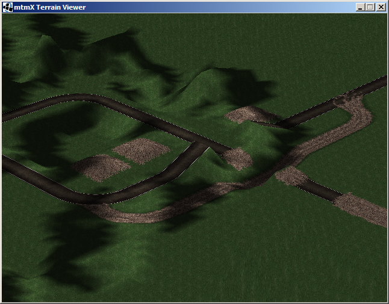
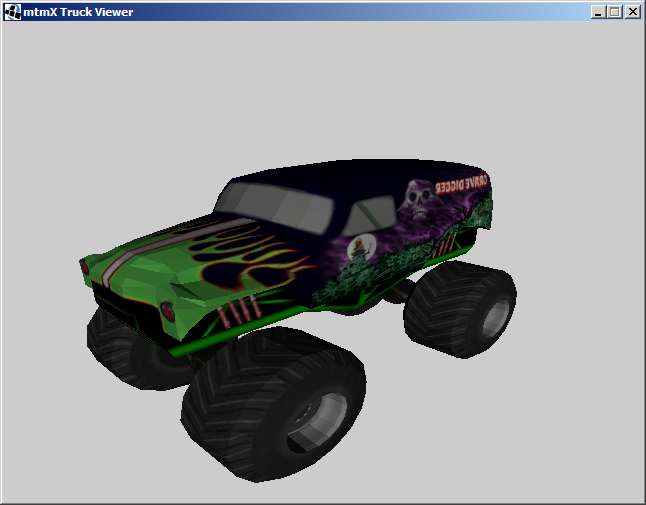
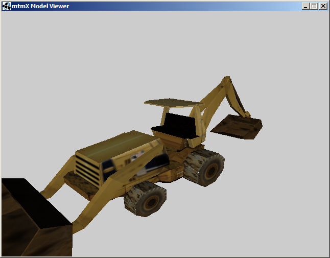
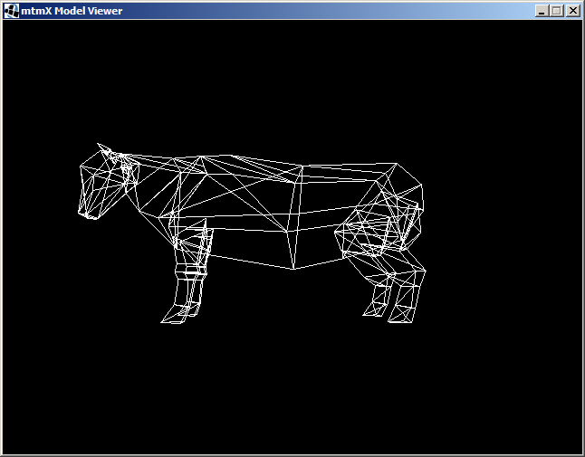
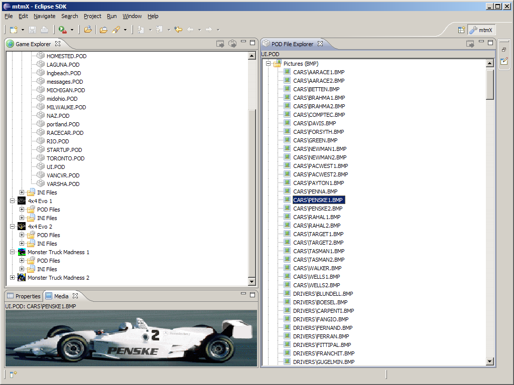
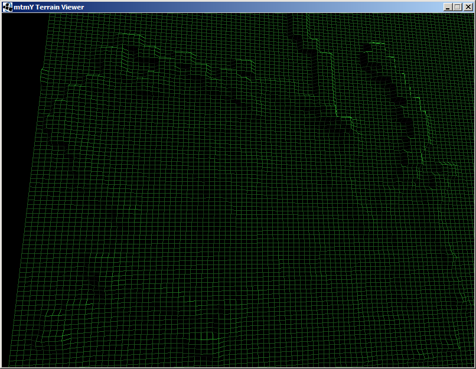
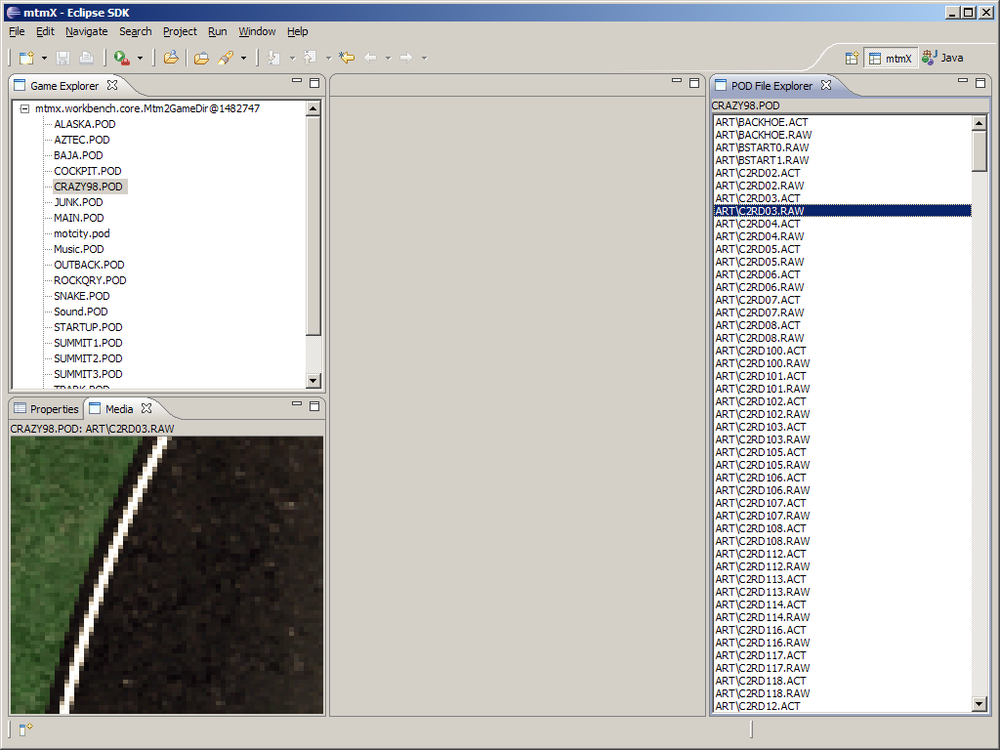

# Workbench screenshots

## #7 World Viewer

This is the all new [world viewer](WorldViewer.md). At the moment it is capable of rendering the terrain and the textures. Models, water and bridges not yet implemented. The screenie show Crazy '98 naked edition ;-)

 

## #6 Truck Viewer

The [truck viewer](TruckViewer.md) is somehow a pimped version of the [model viewer](ModelViewer.md). It is capable of rendering all models a truck is composed of.

The displayed _Grave Digger_ has no drive shaft and shocks at the moment :-(

 

## #5 Model Viewer texture support

Again the [model viewer](ModelViewer.md), but now supporting textures. The picture shows the backhoe from Crazy '98.

 

## #4 Model viewer wireframe

This picture shows the minimalistic [model viewer](ModelViewer.md) rendering a magic cow from Farm Road in wireframe. Yes, its a cow...

 

## #3 Workbench evolved

Again a Workbench shot. The *Game Explorer* now shows other Terminal Reality games like 4x4 Evo and CART Precision Racing. On the right side in the *POD File Explorer* you can see the selected POD file's contents listed by type. The media preview shows an image contained in CART Precison Racing's _ui.pod_.

 

## #2 Terrain Viewer

This screenshot shows the [world viewer](WorldViewer.md) which basically can render all RAW files. What you actually see is _Crazy 98_ in wireframe view. It can be launched via *POD File Explorer* or standalone.

 

## #1 Workbench early preview

This is a screenshot of the mtmX Workbench during development of version 0.0.1. The *Game Browser* shows all POD files. The *POD File Explorer* the contents of a selected POD file. The *Media View* is a visual representation of a texture or an ACT file. The *Properties View* can display meta data like file size or texture dimensions.

 